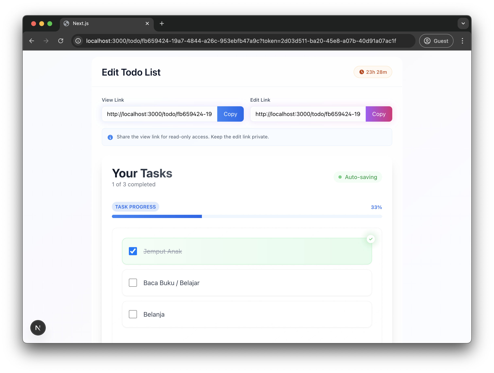

# Todo List Pastebin

Aplikasi Todo List yang dapat dibagikan, dibangun dengan Next.js dan Supabase. Aplikasi ini memungkinkan pengguna untuk membuat, mengedit, dan berbagi daftar tugas tanpa perlu login. Dihasilkan dengan vibe coding menggunakan Cursor.ai.

🚀 **Demo**: [https://todo-list-pastebin.vercel.app/](https://todo-list-pastebin.vercel.app/)



## Fitur

- **Pembuatan Daftar Tugas**: Buat daftar tugas tanpa perlu mendaftar atau login
- **Berbagi Daftar**: Bagikan daftar tugas via URL unik yang dihasilkan setelah pembuatan
- **Auto-sync**: Sinkronisasi otomatis untuk perubahan data
- **Daftar Otomatis Kedaluwarsa**: Daftar tugas akan otomatis terhapus setelah periode waktu tertentu
- **Antarmuka Drag-and-drop**: Susun ulang tugas dengan mudah menggunakan interaksi drag-and-drop
- **UI Modern**: Tampilan modern dan responsif dengan Tailwind CSS
- **No Login Required**: Akses dan edit daftar tugas menggunakan token yang dibagikan
- **Supabase Backend**: Menggunakan Supabase sebagai backend dengan PostgreSQL

## Tech Stack

### Backend

- **Supabase**: Backend-as-a-Service dengan PostgreSQL dan autentikasi
- **PostgreSQL**: Database untuk penyimpanan data
- **Row Level Security**: Keamanan tingkat baris untuk kontrol akses

### Frontend

- **Next.js 14**: Framework React dengan server-side rendering
- **TypeScript**: Bahasa pemrograman yang diketik statis
- **TailwindCSS**: Framework CSS yang utility-first
- **React DnD**: Library untuk drag-and-drop
- **@supabase/supabase-js**: SDK Supabase untuk JavaScript

## Struktur Proyek

```
todo-list-app/
├── frontend/               # Kode frontend Next.js
│   ├── public/             # Aset statis
│   ├── src/
│   │   ├── app/            # Komponen Next.js App Router
│   │   ├── components/     # Komponen React reusable
│   │   ├── hooks/          # Custom React hooks
│   │   ├── lib/            # Library dan utilities
│   │   ├── services/       # Layanan API Supabase
│   │   └── types/          # Type definitions TypeScript
│   ├── .env.local.example  # Template konfigurasi lingkungan
│   └── package.json        # Dependensi frontend
├── supabase/               # Konfigurasi dan migrasi Supabase
├── docs/                   # Dokumentasi proyek
│   ├── api-examples.md     # Contoh penggunaan API
│   ├── installation-guide.md # Panduan instalasi
│   ├── CHANGELOG.md        # Log perubahan
│   └── contributing.md     # Panduan kontribusi
└── README.md               # Dokumentasi proyek
```

## Perubahan Terbaru

**Versi 2.0.0**

- Migrasi penuh ke Supabase sebagai satu-satunya backend
- Penyederhanaan arsitektur aplikasi
- Peningkatan performa sinkronisasi data
- Lihat [CHANGELOG.md](docs/CHANGELOG.md) untuk rincian lengkap

## Instalasi dan Setup

Lihat [docs/installation-guide.md](docs/installation-guide.md) untuk instruksi detail.

### Prasyarat

- Node.js 18 atau lebih tinggi
- NPM atau Yarn
- Akun Supabase

### Panduan Cepat

1. Clone repository
2. Setup Supabase project dan dapatkan credentials
3. Setup frontend:

```bash
cd frontend
npm install
# Konfigurasi .env.local dengan Supabase credentials
npm run dev
```

4. Buka http://localhost:3000

## Penggunaan

### Membuat Daftar Tugas

1. Buka aplikasi di browser
2. Isi daftar tugas yang ingin dibuat
3. Pilih waktu kedaluwarsa daftar (1 jam, 1 hari, 1 minggu)
4. Klik "Create Todo List"
5. Anda akan diarahkan ke halaman edit daftar dengan URL unik

### Berbagi Daftar Tugas

1. Gunakan URL yang dihasilkan untuk berbagi daftar tugas
2. Tambahkan parameter `?token=[edit_token]` untuk memberikan akses edit
3. Tanpa token, daftar hanya dapat dilihat (read-only)

### Mengedit Daftar Tugas

1. Gunakan URL dengan token untuk mengedit daftar
2. Tambahkan tugas baru dengan tombol "Add Task"
3. Tandai tugas selesai dengan mengklik checkbox
4. Atur ulang urutan tugas dengan drag-and-drop
5. Ubah isi tugas dengan mengklik teks tugas
6. Hapus tugas dengan ikon hapus

## API Endpoints

Lihat [docs/api-examples.md](docs/api-examples.md) untuk dokumentasi API lengkap.

## Troubleshooting

Lihat [docs/installation-guide.md](docs/installation-guide.md) untuk panduan troubleshooting umum.

## Kontribusi

Lihat [docs/contributing.md](docs/contributing.md) untuk informasi tentang cara berkontribusi pada proyek ini.

---

Dibuat dengan ❤️ oleh Bhakti Utama
